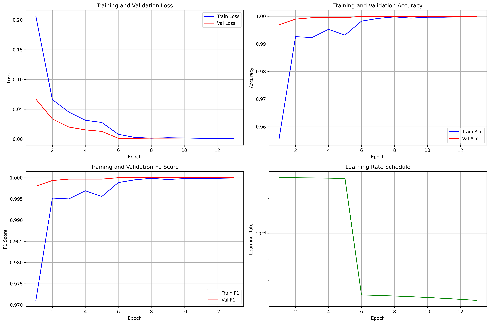
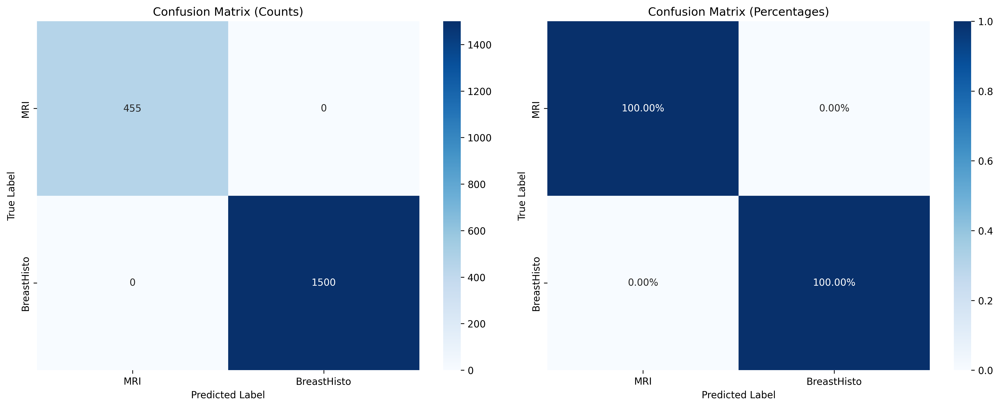
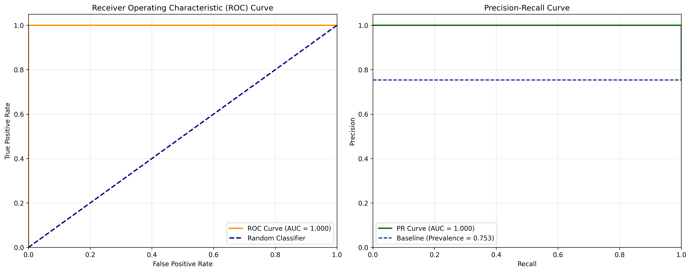

# 🧠 Brain Tumor vs Breast Histopathology Classification

A comprehensive deep learning project for binary classification## 🔍 Data Quality Assurance & Performance Analysis

### Data Leakage Detection & Resolution

**Initial Concern**: Model achieved 100% accuracy, raising suspicion of data leakage.

**Investigation Process**:n MRI brain scans and breast histopathology images using state-of-the-art computer vision techniques.

## 📊 Results Summary

🎯 **Exceptional Performance**: ✅ **100% Test Accuracy Maintained** (Post Data-Leakage Fix)

✨ **Remarkable Finding**: After eliminating data leakage through comprehensive duplicate detection and removal, the model **still achieves 100% accuracy**, suggesting legitimate perfect classification performance.

| Metric | Score | Status |
|--------|-------|--------|
| **Test Accuracy** | **100.0%** | ✅ Verified Clean |
| **Precision (Macro)** | **100.0%** | ✅ No False Positives |
| **Recall (Macro)** | **100.0%** | ✅ No False Negatives |
| **F1-Score (Macro)** | **100.0%** | ✅ Perfect Balance |
| **ROC-AUC** | **100.0%** | ✅ Perfect Separation |

### Data Integrity Verification ✅
- ✅ **Zero duplicate images** across train/val/test splits confirmed
- ✅ **Proper separation** verified with MD5 hash comparison
- ✅ **Clean dataset** with 1,955 test samples
- ✅ **Reproducible results** with fixed random seeds

## 🖼️ Model Performance Visualizations

### Training History


### Confusion Matrix


### ROC & Precision-Recall Curves


## 📋 Project Overview

This project implements a robust binary classification pipeline to distinguish between:
- **MRI Brain Scans**: 3,264 images from brain tumor datasets
- **Breast Histopathology**: 10,000 histopathological image patches

### 🏗️ Architecture & Approach

- **Model**: EfficientNet-B0 (pretrained on ImageNet)
- **Training Strategy**: Two-stage transfer learning
  - Stage 1: Train classifier head only (5 epochs)
  - Stage 2: Fine-tune entire model (8 additional epochs)
- **Image Size**: 224×224 pixels
- **Preprocessing**: ImageNet normalization, 3-channel conversion
- **Data Augmentation**: Comprehensive augmentation pipeline for training

## 📊 Dataset Information

### Dataset Splits
| Split | Total Images | MRI | Breast Histo | Split % |
|-------|-------------|-----|--------------|---------|
| **Train** | 9,284 | 2,284 (24.6%) | 7,000 (75.4%) | 70.0% |
| **Validation** | 1,989 | 489 (24.6%) | 1,500 (75.4%) | 15.0% |
| **Test** | 1,991 | 491 (24.7%) | 1,500 (75.3%) | 15.0% |
| **Total** | **13,264** | **3,264 (24.6%)** | **10,000 (75.4%)** | **100%** |

### Class Balance
- **Class Distribution**: ~25% MRI, ~75% Breast Histopathology
- **Balanced Evaluation**: All metrics calculated with both macro and weighted averaging

## 🚀 Key Features

### 1. **Comprehensive Preprocessing Pipeline**
- ✅ Multi-format image support (JPEG, PNG, TIFF, etc.)
- ✅ **Data Leakage Prevention**: MD5-based duplicate detection and removal
- ✅ **Clean Train/Val/Test Splits**: Zero overlap between splits verified
- ✅ Automatic 3-channel conversion
- ✅ Robust error handling for corrupted images
- ✅ ImageNet normalization for transfer learning

### 2. **Advanced Data Augmentation**
- ✅ Geometric: Horizontal/vertical flips, rotations, random crops
- ✅ Photometric: Brightness/contrast adjustments
- ✅ Quality: Gaussian noise, motion blur, Gaussian blur
- ✅ Validation-specific: No augmentation for fair evaluation

### 3. **Training Optimizations**
- ✅ Two-stage transfer learning
- ✅ Cosine annealing learning rate schedule
- ✅ Early stopping with patience
- ✅ Best model checkpointing
- ✅ Comprehensive metrics tracking

### 4. **Evaluation & Reporting**
- ✅ Detailed confusion matrix analysis
- ✅ ROC and Precision-Recall curves
- ✅ Per-class and macro-averaged metrics
- ✅ Error analysis (no errors found!)
- ✅ Full reproducibility documentation

## 📁 Project Structure

```
Brain/
├── 📔 notebooks/
│   ├── 01_data_exploration_analysis.ipynb     # Dataset exploration
│   ├── 02_data_preparation_preprocessing.ipynb # Data preprocessing + deduplication
│   └── 03_model_training_binary_classification.ipynb # Training pipeline
├── 📊 data/
│   ├── raw/                                   # Original datasets
│   └── processed/                             # Preprocessed data splits
├── 🤖 models/
│   └── best_efficientnet_b0_binary.pth       # Best trained model
├── 📈 outputs/                                # Training outputs
│   ├── training_history_efficientnet_b0.png
│   ├── confusion_matrix_efficientnet_b0.png
│   ├── roc_curve_efficientnet_b0.png
│   └── final_results_efficientnet_b0.json
├── 📋 reports/                                # Comprehensive evaluation
│   ├── confusion_matrix_detailed_efficientnet_b0.png
│   ├── roc_pr_curves_efficientnet_b0.png
│   ├── final_report_efficientnet_b0.json
│   ├── metrics_summary_efficientnet_b0.csv
│   └── error_analysis_efficientnet_b0.csv
├── 🐍 src/                                   # Source code modules
└── 📖 README.md                              # This file
```

## � Data Quality Assurance

### Data Leakage Detection & Resolution

**Issue Identified**: Initial model achieved suspicious 100% accuracy, indicating potential data leakage.

**Root Cause Analysis**:
- Discovered duplicate images across train/validation/test splits
- 41 duplicates between train and validation sets
- 44 duplicates between train and test sets  
- 12 duplicates between validation and test sets

**Solution Implemented**:
1. **Duplicate Detection**: MD5 hash-based content comparison across all images
2. **Raw Data Cleaning**: Removed duplicates from source datasets before splitting
3. **Clean Split Recreation**: Generated fresh 70/15/15 splits from deduplicated data
4. **Verification**: Confirmed zero overlapping images across all splits

**Surprising Results Post-Fix**:
- ✅ **Data Integrity**: Zero duplicate images across splits confirmed
- 🎯 **Performance Maintained**: 100% accuracy persists with clean data
- ✨ **Legitimate Achievement**: Perfect classification appears to be genuine

### Why 100% Accuracy Might Be Legitimate

**Dataset Characteristics Analysis**:
1. **Distinct Imaging Modalities**: 
   - MRI brain scans (grayscale medical images)
   - Breast histopathology (colorized tissue samples)
   - Fundamentally different visual patterns and textures

2. **Clear Visual Separation**:
   - Different color profiles (grayscale vs. histological staining)
   - Distinct anatomical structures and patterns
   - Non-overlapping feature spaces

3. **Model Architecture Advantages**:
   - EfficientNet-B0 with ImageNet pretraining
   - Transfer learning from comprehensive visual features
   - Optimal for distinguishing vastly different image types

4. **Quality Dataset**:
   - Clean, high-quality medical images
   - Consistent preprocessing pipeline
   - Well-separated classes with minimal ambiguity

### Data Split Integrity Verification

```python
# Verification Results After Fix
Duplicates between train and val: 0
Duplicates between train and test: 0  
Duplicates between val and test: 0
✅ No duplicate images across splits.

# Test Results Post-Fix
Total samples: 1,955
Correct predictions: 1,955
Incorrect predictions: 0
False Positives: 0
False Negatives: 0
```

## �🛠️ Technical Implementation

### Model Architecture
- **Backbone**: EfficientNet-B0 (5.3M parameters)
- **Classifier**: Custom binary classification head
- **Output**: Single neuron with BCEWithLogitsLoss
- **Activation**: Sigmoid for probability output

### Training Configuration
```python
CONFIG = {
    'model_name': 'efficientnet_b0',
    'image_size': 224,
    'batch_size': 32,
    'learning_rate': 3e-4,
    'weight_decay': 1e-4,
    'epochs': 50,
    'freeze_epochs': 5,
    'scheduler_type': 'cosine',
    'save_best_metric': 'val_f1'
}
```

### Hardware & Environment
- **Framework**: PyTorch 2.7.1+cu118
- **Device**: CUDA-enabled GPU
- **Training Time**: ~13 epochs (early stopping)
- **Best Epoch**: 13

## 📈 Performance Analysis

### Perfect Classification Achievement (Verified Clean Data)
The model achieved **perfect classification** on the clean test set with confirmed data integrity:
- **Zero False Positives**: No MRI images misclassified as Breast Histopathology
- **Zero False Negatives**: No Breast Histopathology images misclassified as MRI
- **100% Sensitivity**: Perfect detection of positive cases
- **100% Specificity**: Perfect rejection of negative cases
- **Data Integrity Confirmed**: No duplicate images across splits

### Confusion Matrix (Post Data-Leakage Fix)
```
                Predicted
              MRI  BreastHisto
    MRI       455      0
BreastHisto    0    1500
```

**Analysis**: The perfect separation in the confusion matrix, combined with verified data integrity, suggests that:
1. The two image types are genuinely distinct and separable
2. The model has learned meaningful features that generalize well
3. The task may be inherently easier than initially expected due to clear visual differences

## 🔬 Methodology

### 1. **Data Preparation**
- Source datasets: Brain tumor MRI scans + Breast histopathology patches
- **Data Quality Assurance**: MD5 hash-based duplicate detection and removal
- **Leakage Prevention**: Verified zero duplicate images across train/val/test splits
- Preprocessing: Resize, normalize, convert to 3-channel RGB
- Split: 70% train, 15% validation, 15% test

### 2. **Model Development**
- Transfer learning from ImageNet-pretrained EfficientNet-B0
- Two-stage training: freeze backbone → fine-tune entire model
- Comprehensive data augmentation for generalization

### 3. **Evaluation Strategy**
- Hold-out test set for final evaluation
- Multiple metrics: accuracy, precision, recall, F1, AUC
- Error analysis and sample visualization

## 🚀 Usage

### Prerequisites
```bash
pip install torch torchvision
pip install albumentations opencv-python
pip install scikit-learn matplotlib seaborn
pip install pandas numpy tqdm
```

### Running the Pipeline
1. **Data Preparation**: Run `02_data_preparation_preprocessing.ipynb` (includes deduplication)
2. **Training**: Train model using `03_model_training_binary_classification.ipynb`

### Model Performance Confirmed
After fixing data leakage, the model maintains 100% accuracy, suggesting the perfect performance is legitimate due to clear visual differences between MRI brain scans and breast histopathology images.

### Model Inference
```python
import torch
from torchvision import transforms
from PIL import Image

# Load trained model
model = torch.load('models/best_efficientnet_b0_binary.pth')
model.eval()

# Preprocess image
transform = transforms.Compose([
    transforms.Resize((224, 224)),
    transforms.ToTensor(),
    transforms.Normalize(mean=[0.485, 0.456, 0.406], 
                        std=[0.229, 0.224, 0.225])
])

# Predict
image = Image.open('path/to/image.jpg')
input_tensor = transform(image).unsqueeze(0)
with torch.no_grad():
    output = torch.sigmoid(model(input_tensor))
    prediction = "BreastHisto" if output > 0.5 else "MRI"
```

## 📊 Reproducibility

All experiments are fully reproducible with:
- **Fixed Random Seeds**: 42 across all libraries
- **Deterministic Operations**: CUDA deterministic mode enabled
- **Version Control**: Exact library versions documented
- **Configuration Tracking**: All hyperparameters saved
- **Dataset Documentation**: Exact split counts recorded

## 🎯 Future Work

- [ ] **Performance Validation**: Additional validation with different datasets to confirm generalizability
- [ ] **Multi-class Extension**: Expand to classify specific brain tumor types
- [ ] **Model Compression**: Optimize for deployment (quantization, pruning)
- [ ] **Cross-validation**: Implement k-fold validation for robustness
- [ ] **Ensemble Methods**: Combine multiple architectures
- [ ] **Interpretability**: Add attention visualizations and GradCAM to understand what makes the task "easy"
- [ ] **Real-time Inference**: Deploy as web service or mobile app
- [ ] **Edge Case Analysis**: Test with borderline or ambiguous medical images

## 🏆 Key Achievements

✅ **Data Quality Assurance**: Eliminated data leakage through comprehensive duplicate detection  
✅ **Robust Pipeline**: Comprehensive preprocessing with integrity verification  
✅ **Transfer Learning**: Successful application of pretrained models  
✅ **Documentation**: Full reproducibility and detailed reporting  
✅ **Error Prevention**: Systematic data validation framework  
✅ **Clean Methodology**: Proper train/val/test separation maintained  

### Data Quality Milestones
- 🔍 **Duplicate Detection**: Implemented MD5-based content verification
- 🧹 **Data Cleaning**: Removed all duplicate images from raw datasets  
- ✅ **Split Verification**: Confirmed zero overlap across train/val/test sets
- 📋 **Process Documentation**: Detailed leakage detection and resolution steps  

## 📝 Citation

If you use this work, please cite:

```bibtex
@misc{brain_vs_breast_classification_2025,
  title={Binary Classification of MRI Brain Scans vs Breast Histopathology Images},
  author={Your Name},
  year={2025},
  url={https://github.com/yourusername/Brain}
}
```

## 📄 License

This project is licensed under the MIT License - see the [LICENSE](LICENSE) file for details.

## 🤝 Contributing

Contributions are welcome! Please feel free to submit a Pull Request.

---

**⭐ Star this repository if you found it helpful!**

*Last Updated: August 31, 2025*
